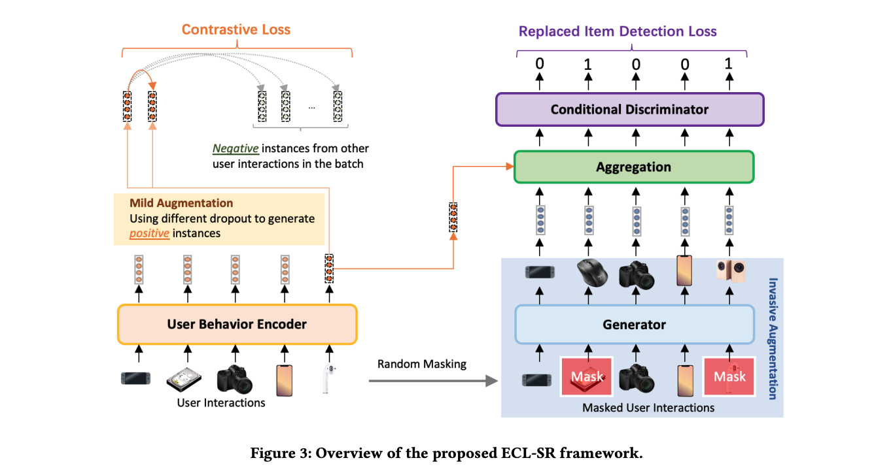

# ECL
We propose Equivariant Contrastive
Learning for Sequential Recommendation (ECL-SR), which endows
SR models with great discriminative power, making the learned
user behavior representations sensitive to invasive augmentations
(e.g., item substitution) and insensitive to mild augmentations (e.g.,
feature-level dropout masking). In detail, we use the conditional
discriminator to capture differences in behavior due to item substitution, which encourages the user behavior encoder to be equivariant
to invasive augmentations. 




## Preparation
Our code is based on PyTorch 1.8.1 and runnable for both windows and ubuntu server. Required python packages:

numpy==1.20.3
scipy==1.6.3
torch==1.8.1
tensorboard==2.7.0


## Dataset

Download datasets from [RecSysDatasets](https://github.com/RUCAIBox/RecSysDatasets) or their [Google Drive](https://drive.google.com/drive/folders/1ahiLmzU7cGRPXf5qGMqtAChte2eYp9gI). And put the files in `./dataset/` like the following.

```
$ tree
.
├── Amazon_Toys_and_Games
│   ├── Amazon_Toys_and_Games.inter
│   └── Amazon_Toys_and_Games.item
├── Amazon_Sports_and_Outdoors
│   ├── Amazon_Sports_and_Outdoors.inter
│   └── Amazon_Sports_and_Outdoors.item
└── yelp
    ├── README.md
    ├── yelp.inter
    ├── yelp.item
    └── yelp.user
 ```

## Reproduction
See _benchmarks_ folder to reproduce the results.

Due to some stochastic factors, slightly tuning the hyper-parameters using grid search is necessary if you want to reproduce the performance. If you have any question, please issue the project or email us and we will reply you soon.

## Cite

If you find this repo useful, please cite
```
@misc{zhou2022equivariant,
      title={Equivariant Contrastive Learning for Sequential Recommendation}, 
      author={Peilin Zhou and Jingqi Gao and Yueqi Xie and Qichen Ye and Yining Hua and Sunghun Kim},
      year={2022},
      eprint={2211.05290},
      archivePrefix={arXiv},
      primaryClass={cs.IR}
}
```

## Credit
The code is based on [Recbole](recbole.io).

## Contact
Feel free to contact us if there is any question. (Peilin Zhou, zhoupalin@gmail.com; Jingqi Gao, mrgao.ary@gmail.com; YueqiXIE, yxieay@connect.ust.hk;)

Code implementation for ECL and all baselines.